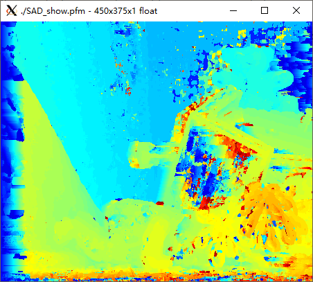
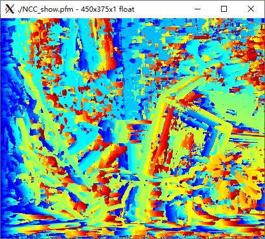
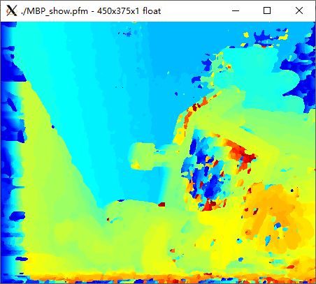
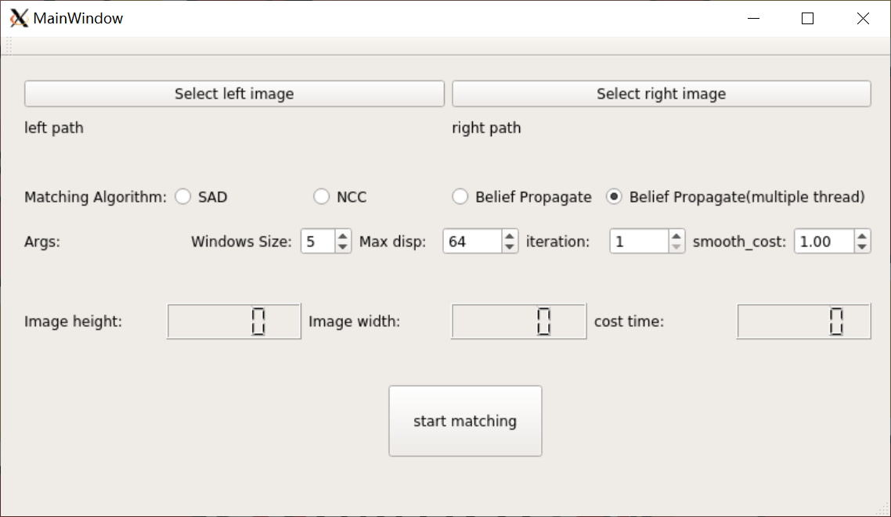

# stereoMatching
stereo matching, disparity estimation. 

**A Camera Calibration repo of mine is available [here](https://github.com/zhaone/ProjectStereo).**

> Hope this project can help you or evoke your interest in stereo matching is interesting. I would be happy if you give me a star ^_^ !

Master branch provides GUI version stereo matching program for depth estimation. [cli](https://github.com/zhaone/stereoMatching/tree/cli) branch provides a command line version and can be evaluated on [middlebury](http://vision.middlebury.edu/stereo/eval3/). The code is tested on Ubuntu 18.04.

## result
**Sum of absolute differences. Basic.**

**Normal Cross Correlation. Not very well.**

**Belief Propagation. Not bad, smoother.**

## build
The code depends on [Opencv 4.2](https://opencv.org/releases/) and [qt](https://www.qt.io/) make sure you have installed lib OpenCV and qt before you build this project. Libtiff4 is not available on My OS(Ubuntu 18.04), so when compiling OpenCV lib, you'd better add `-DBUILD_TIFF=ON`. 

To build this project, just use qt-creator open seteroMatchingQt.pro, and compile.

## usage
This is the GUI program. 

To compute disparity of two images:
1. choose the left and right image paths. eg. leftImage: ./img/Teddy/im0.png leftImage:./img/Teddy/im1.png
2. choose a stereo matching method. This code implements 4 methods, includes
   - SAD(Sum of absolute differences)
   - NCC(Normal Cross-Correlation), the result is not very well
   - Belief Propagation, the result is smoother than SAD but very slow.
   - a multiple thread implement of Belief Propagation, faster than BP.
3. set algorithm args.
   -  Window Size: for all 4 algorithms, the size of the window when computing the matching cost of each pixel.
   -  Max disp: for all 4 algorithms, the maximum disparity in two images.
   -  iteration: for BP and MBP, number of iteration of BP and MBP algorithms.
   -  smooth_cost: for BP and MBP. The bigger smooth_cost is, the smoother the output disparity map is.
4. click `start matching` button and wait program compute and display the final disparity map.

You may need to wait for some time to get the final disparity map for the left image, when using BP or MBP algorithm and setting a big iteration number, it may cost quite a long time. 

The program will display a disparity map, image height, image width, and cost time after finishing computing.
